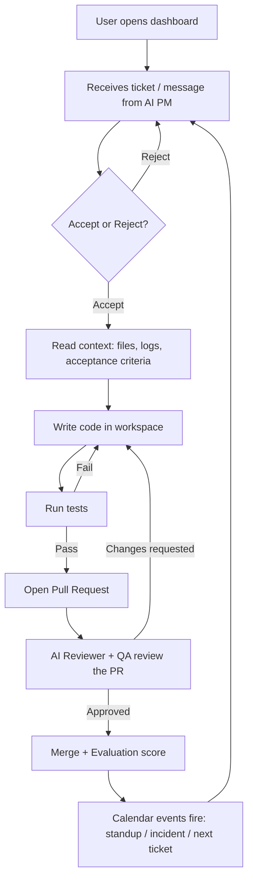
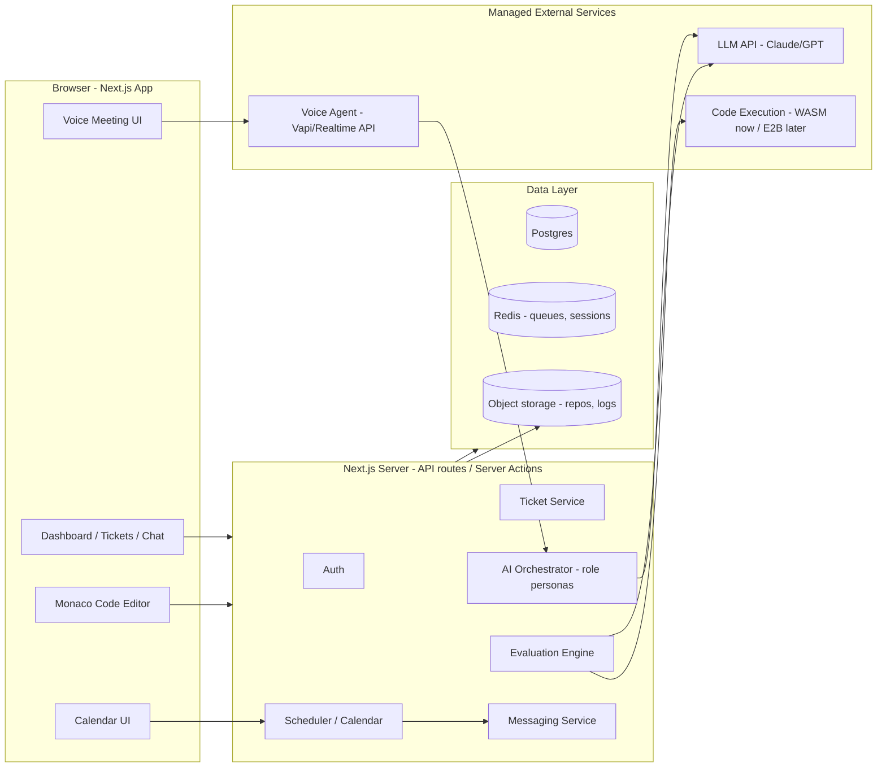
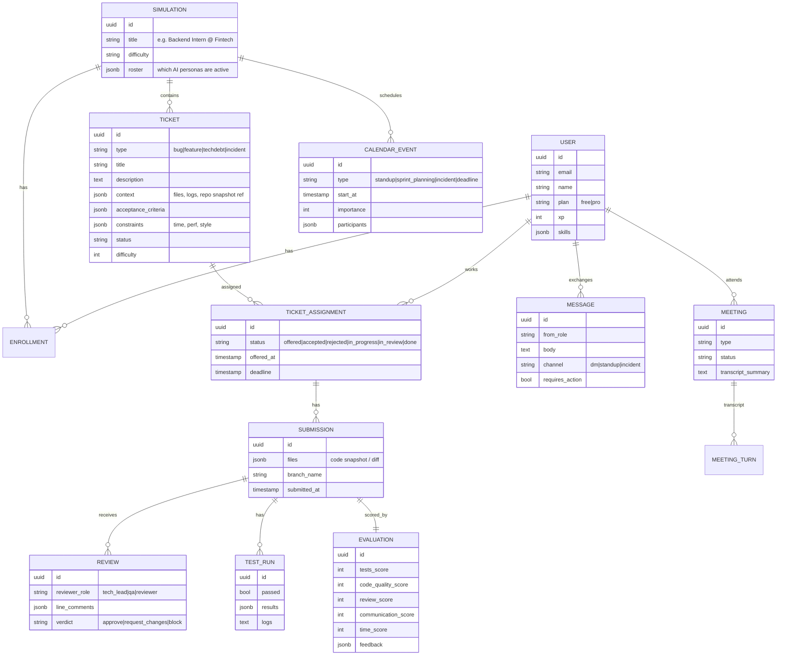
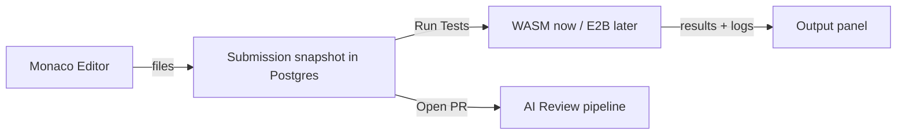
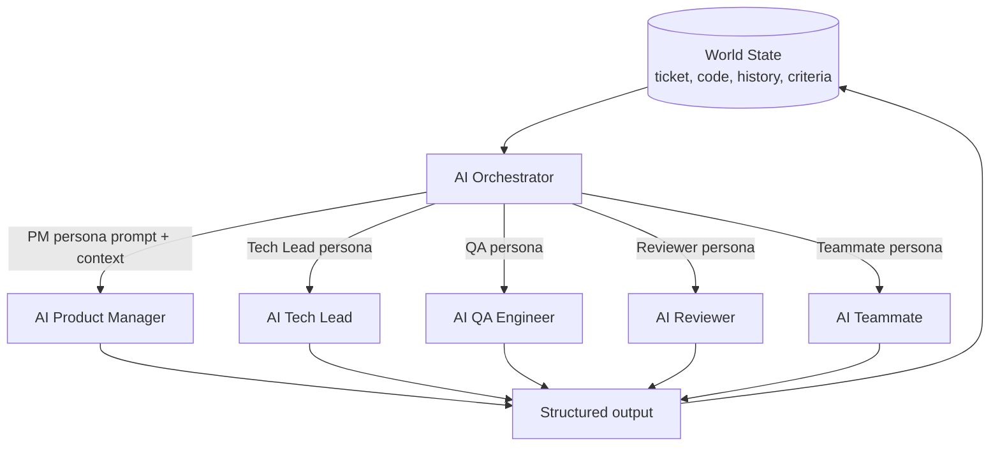
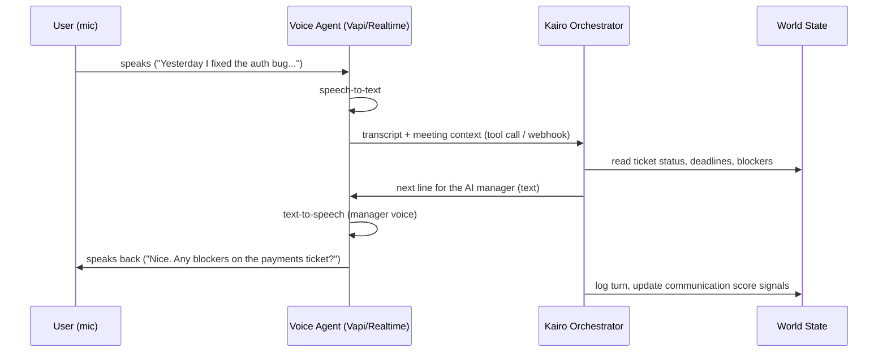
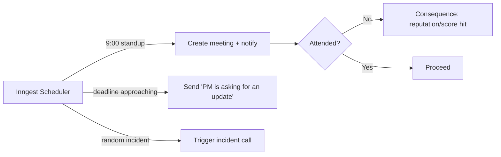
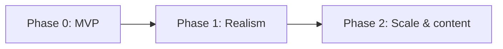

# Kairo — System Architecture & Design

> **One-line pitch:** A flight simulator for software engineering. Kairo drops you into a simulated AI-run engineering team — tickets, standups, code reviews, incident calls — so you experience what a real SWE job *feels* like, not just whether your code passes tests.

**Status:** Design document (no code yet)
**Audience:** Founder (non-technical) + any engineer who builds this
**Last updated:** 2026-06-02

---

## 0. Decisions locked in (from our Q&A)

| Decision | Choice | Notes |
|---|---|---|
| Deliverable now | Architecture & design docs only | This document |
| Primary users | Interview/internship preppers **+** CS students with no real job experience | Two personas, one product |
| Code execution | **Recommendation provided** (see §6) | Start browser-based, grow into cloud sandboxes |
| Task content | Small self-contained tasks first | Grow into multi-file mini-repos later |
| AI team | Single LLM with role personas | One model, many "characters" sharing world state |
| Stack | Next.js + TypeScript + Postgres | Full-stack TypeScript |
| Meetings | **Voice** conversations | The headline differentiator |
| Model strategy | Balanced (good models, watch cost) | See §11 cost model |
| Monetization | Freemium | Free tier + Pro |
| Founder | Solo, non-technical | Bias toward managed services, less infra to babysit |

---

## 1. What Kairo actually is

Most "learn to code" products test **correctness**. Kairo tests **job readiness**: communication, prioritization, debugging under pressure, reading someone else's code, and responding to a manager.

The product simulates an entire engineering team made of AI characters:

- **AI Product Manager** — hands you tickets, sets acceptance criteria, changes requirements.
- **AI Tech Lead** — clarifies architecture, reviews your approach, approves/blocks.
- **AI QA Engineer** — finds edge cases, rejects broken fixes.
- **AI Reviewer** — leaves GitHub-style line comments on your PR.
- **AI Teammate** — asks clarifying questions, files blockers, pings you on Slack-style chat.

Around this team sit four systems that make it feel like a job:

1. **Ticket system** (the core work loop)
2. **Code workspace** (editor + run tests)
3. **AI meetings** (voice: standup, sprint planning, incident calls)
4. **Calendar + task messaging** (events, deadlines, accept/reject mechanic)

And an **evaluation engine** that scores you on *more than* tests passing.

### Why this wins
LeetCode/HackerRank measure algorithmic correctness. Bootcamps teach syntax. **Nobody simulates the social + workflow reality of the job.** That gap is Kairo's moat: the voice standups, the "production incident at 4pm," the reviewer who nitpicks your variable names — that emotional realism is hard to copy and is exactly what students/interviewees are terrified of.

---

## 2. Core product loop

This loop is the heartbeat. Everything else (meetings, calendar, messaging) injects events *into* this loop to create realism and pressure.

---

## 3. High-level architecture

**Key idea for a solo non-technical founder:** keep the *core* in one Next.js app, and push the hard/expensive infrastructure (LLM, voice, code execution) to **managed external services** you call over an API. You don't run GPU servers or sandbox clusters yourself.

---

## 4. Recommended tech stack

| Layer | Choice | Why |
|---|---|---|
| Framework | **Next.js (App Router) + TypeScript** | One language front-to-back, great hosting story |
| UI | **Tailwind CSS + shadcn/ui** | Fast, professional-looking UI without a designer |
| Editor | **Monaco Editor** (the VS Code editor) | Familiar to devs, syntax highlighting, free |
| Auth | **Clerk** or **Auth.js (NextAuth)** | Clerk = least work for a non-technical founder |
| Database | **Postgres** (via **Supabase** or **Neon**) | Managed, generous free tiers, scales later |
| ORM | **Prisma** or **Drizzle** | Type-safe DB access from TypeScript |
| Background jobs / queue | **Inngest** (recommended) or Redis + BullMQ | Inngest is serverless-friendly, perfect for "fire this event in 2 hours" |
| Cache / realtime | **Upstash Redis** + **Pusher/Ably** (or Supabase Realtime) | For live chat, presence, queues |
| LLM | **Anthropic Claude** + **OpenAI** (router) | Use cheap models for chat, strong models for review |
| Voice | **Vapi** or **OpenAI Realtime API** | Managed voice agents = no WebRTC plumbing |
| Code execution | **Pyodide/WebContainers** (MVP) → **E2B/Daytona** (V1) | See §6 |
| Hosting | **Vercel** | Native Next.js host, deploy by git push |
| Payments | **Stripe** | Freemium + Pro subscriptions |
| Analytics | **PostHog** | Product analytics + funnels + feature flags |
| Error tracking | **Sentry** | Catch bugs in prod |

> **Rationale:** Every "hard" piece is a managed SaaS with a free/cheap tier and a TypeScript SDK. A solo non-technical founder (with AI help) can operate this whole stack without managing servers.

---

## 5. Data model (core entities)

**Design notes:**
- A **Simulation** is a "job" the user takes (e.g., "Backend Intern at a fintech startup"). It bundles a roster of AI personas, a difficulty curve, and a stream of tickets/events. This is the unit you'll sell and expand (a content library).
- A **Ticket** has rich `context`, `acceptance_criteria`, and `constraints` — exactly as you specified.
- The **accept/reject** mechanic lives on `TICKET_ASSIGNMENT.status` (`offered → accepted/rejected`).
- **Evaluation** is multi-dimensional (tests, quality, review, communication, time) — not pass/fail.

---

## 6. Code workspace & execution strategy (my recommendation)

You chose "recommend the best path." Here it is, in phases, optimized for *not* drowning a solo founder in infrastructure.

### The core tension
Running untrusted user code safely is the single hardest/most expensive part of any coding platform. So **delay it as long as possible** and use managed services when you can't.

### Phase 0 (MVP) — Run code *in the browser*, no servers
- **Python tasks → Pyodide** (Python compiled to WebAssembly, runs in the user's tab).
- **JS/TS tasks → WebContainers** (StackBlitz) or a Web Worker sandbox.
- Tests run client-side; results posted to the server.
- **Pros:** zero execution infra, zero security risk to your servers, free, instant.
- **Cons:** limited to languages with WASM runtimes, no full repos, no native packages.
- **Verdict:** Perfect for "small self-contained tasks" — which is exactly your starting content choice.

### Phase 1 (V1) — Managed cloud sandboxes
- Use **E2B**, **Daytona**, or **CodeSandbox SDK** to spin up a real container per task on demand.
- Enables multi-file mini-repos, real `npm install`/`pip install`, real test suites, terminals.
- You call an API; they handle isolation, scaling, teardown.
- **Verdict:** Graduate here once tasks outgrow the browser. No self-hosted Docker.

### Phase 2 (later) — Self-hosted Firecracker/gVisor
- Only if scale/cost economics demand owning execution. Probably never needed pre-Series A.

### Editor + "git-like" layer
- **Monaco Editor** for the code surface.
- A **simplified commit/PR model** stored in Postgres: a `SUBMISSION` is a snapshot/diff; "opening a PR" triggers AI review. You don't need real git initially — simulate branches/commits as rows. Real git can come via the sandbox in Phase 1.

---

## 7. The AI "engineering team" (single model, many roles)

You chose **one LLM with role personas**. Here's how to make that feel like a real team without true multi-agent complexity.

### The Orchestrator pattern
A single **AI Orchestrator** service owns a shared **World State** (the ground truth of the simulation) and renders different *personas* by swapping system prompts + the slice of context each role can "see."

**Each persona = a prompt template + a defined role contract:**
- **Personality & voice** (PM is business-y, Tech Lead is pragmatic, QA is skeptical, Reviewer is nitpicky-but-fair).
- **What it can see** (Reviewer sees the diff + criteria; PM sees the roadmap; QA sees acceptance criteria + edge cases).
- **What it must output** (structured JSON: e.g., review = `{verdict, line_comments[], summary}`).

**Why this is the right call for now:** one model, predictable cost, easy to tune, no agent-coordination bugs. You can later upgrade the "review" or "incident" flows to true multi-agent (agents debating) if it adds value — the Orchestrator boundary makes that swap clean.

### Structured outputs = reliability
Force every AI role to return **typed JSON** (validated with Zod). This keeps the simulation deterministic to render in the UI and prevents the model from breaking the game loop with free-form rambling.

### Consistency across a simulation
- Persist persona "memory" (decisions made, your past performance, prior PR feedback) in the DB and feed a summarized slice into each call. This makes the Tech Lead *remember* yesterday's standup — crucial for realism.

---

## 8. AI meetings — voice architecture (the differentiator)

You chose **voice**. This is the riskiest/coolest part, so here's a concrete, low-plumbing path.

### Recommended approach: managed voice agent
Use **Vapi** (or **OpenAI Realtime API**) so you don't build WebRTC, speech-to-text, and text-to-speech from scratch.

### Meeting types (each = a scripted-but-dynamic scenario)
- **Daily standup** — AI asks the 3 questions; scores clarity/honesty; flags if your verbal report mismatches your actual ticket progress.
- **Sprint planning** — AI proposes tickets + estimates; you negotiate scope.
- **Incident call** — a production bug is injected; you debug live under time pressure while the AI "incident commander" pushes for updates.

### MVP de-risking
- Ship **text meetings first internally** (same Orchestrator, no voice) to prove the *content* is good, then flip on Vapi for voice. Cheap insurance; the logic is identical, only the I/O channel changes.
- Voice is also a natural **Pro-tier** feature (it costs you the most per minute).

### Scoring meetings
Transcripts feed the **communication score**: did you give a clear status? Mention blockers? Stay calm in the incident? The Orchestrator grades the transcript against a rubric.

---

## 9. Calendar & task-messaging systems

### Calendar / scheduler
Model events as objects: `{ type, start_at, importance, participants }` (as you described). A background scheduler (**Inngest**) fires events at the right time.

**Game mechanic:** missing/declining events has consequences (reputation, score, fewer interesting tickets) — optional and tunable. Keep it encouraging, not punishing, for the "CS student, never had a job" persona.

### Task messaging (Slack-style)
- A chat surface where AI personas DM you: *"Can you take this bug today?"*, *"Production issue — need help ASAP,"* *"Client wants a change before release."*
- Messages can carry `requires_action: true` and an **Accept / Reject** control.
- **Accept/reject is the prioritization mini-game:** accepting too much → you miss deadlines; rejecting everything → boredom/low growth. The AI PM reacts to your choices (realistic pushback or understanding).

---

## 10. Evaluation engine (beyond pass/fail)

Every submission produces a multi-dimensional **Evaluation**:

| Dimension | How it's measured | Source |
|---|---|---|
| **Tests passing** | Automated test results | Code execution (WASM/E2B) |
| **Code quality** | Readability, structure, idioms, complexity | LLM reviewer + optional linters |
| **AI review score** | Did the PR satisfy reviewer/QA? Rounds needed? | Review pipeline |
| **Time to resolve** | Wall-clock vs. estimate | Timestamps |
| **Communication** | Standup clarity, blocker-raising, incident composure | Meeting transcripts (LLM rubric) |

- Combine into an overall score + **specific, actionable feedback** (the real value — like a senior eng mentor).
- Feed scores into **XP / skill tree / leveling** to drive retention and progression.
- Store rubrics as data so you can tune grading without code changes.

---

## 11. AI model & cost strategy (balanced)

The economics make or break a freemium AI product. Strategy: **route by task to the cheapest model that's good enough.**

| Use case | Suggested tier | Why |
|---|---|---|
| Casual teammate chat, standup prompts | Cheap/fast model (e.g., Claude Haiku / GPT-mini) | High volume, low stakes |
| PR review, QA edge cases, evaluation | Strong model (e.g., Claude Sonnet / GPT-class) | Quality matters, lower volume |
| Voice meetings | Realtime voice model (Vapi/OpenAI Realtime) | Priced per minute — gate behind Pro |

**Cost controls:**
- **Caching & summarization:** never resend full history; keep a rolling summarized World State.
- **Token budgets per action;** structured JSON outputs (shorter, cheaper).
- **Rate-limit free tier** (e.g., N tickets/day, text meetings only). Voice + unlimited tickets = Pro.
- **Track cost per user** in PostHog/Stripe to protect margins. AI cost per active user is your #1 metric to watch.

---

## 12. Security & safety

- **Untrusted code:** never run it on your own servers — WASM (client-side) or isolated managed sandboxes (E2B) only.
- **Prompt injection:** treat AI outputs as untrusted; validate all structured outputs with Zod before acting; never let model output execute privileged actions directly.
- **PII / auth:** offload to Clerk/Auth.js + Stripe; don't store card data.
- **Rate limiting & abuse:** cap LLM/voice usage per user; detect prompt-farming.
- **Content guardrails:** persona prompts constrained so AI stays in-character and professional.

---

## 13. Phased roadmap

### Phase 0 — MVP (prove the core loop is fun)
- Auth, one **Simulation** ("Backend Intern"), a handful of hand-authored tickets.
- Monaco editor + **browser (WASM) execution** for small tasks.
- Single-model Orchestrator: **PM (gives ticket)** + **Reviewer (reviews PR)**.
- Simplified PR/commit model in Postgres.
- Basic evaluation (tests + review + quality).
- **Text** standup (voice off) to validate content cheaply.
- **Goal:** does the accept-ticket → code → review → score loop feel like a job? Get 10–20 testers.

### Phase 1 — Realism (turn on the magic)
- **Voice meetings** via Vapi (standup + first incident scenario).
- Calendar/scheduler (Inngest) + task messaging with **accept/reject**.
- Full AI roster (Tech Lead, QA, Teammate).
- Communication scoring from transcripts.
- Freemium gating + Stripe.

### Phase 2 — Scale & content
- Managed cloud sandboxes (E2B) → multi-file mini-repos.
- Content library: more simulations (frontend, data, on-call), difficulty curves.
- Skill tree / XP / progression, leaderboards.
- B2B option for bootcamps/universities (cohorts, dashboards) as a future revenue line.

---

## 14. Monetization (freemium)

| Tier | Includes | Purpose |
|---|---|---|
| **Free** | Limited tickets/day, **text** meetings, 1 simulation | Acquisition + virality |
| **Pro (subscription)** | Voice meetings, unlimited tickets, all simulations, incident mode, detailed feedback | Core revenue; aligns price with your AI cost (voice is the expensive bit) |
| **B2B (later)** | Cohort seats, instructor dashboards, custom simulations | Bootcamps/universities; higher ACV |

The clean alignment: **voice = your biggest cost = your premium feature.** That keeps freemium margins safe.

---

## 15. Key risks & open questions

| Risk | Mitigation |
|---|---|
| **AI cost per user** eats margins | Model routing, caching, rate limits, voice behind Pro (§11) |
| Running untrusted code safely | WASM first, managed sandboxes later — never self-host early (§6) |
| AI feedback quality feels generic | Strong model for review, rubric-based grading, persona memory |
| Content creation bottleneck (writing good tickets) | Build an internal **authoring tool**; later AI-assisted ticket generation |
| Voice latency/awkwardness | Use managed realtime providers; ship text fallback |
| Scope creep (this is a *big* vision) | Ruthless Phase 0; prove the loop before adding systems |

**Open questions to decide before building Phase 0:**
1. First simulation persona/domain — Backend? Frontend? Full-stack? (Pick ONE.)
2. Which languages for MVP tasks (Python and/or JS/TS — both have great WASM runtimes)?
3. Brand/tone of the AI team — friendly mentor vs. realistic-tough? (Likely friendlier for the student persona.)
4. How "punishing" should missed deadlines/meetings be? (Game-feel tuning.)

---

## 16. Summary

Kairo's architecture is deliberately **thin where it can be and managed where it's hard**:

- A single **Next.js + TypeScript + Postgres** app holds the core loop.
- The **AI team** is one model wearing many persona hats over a shared World State.
- The **expensive/risky parts** (LLM, voice, code execution) are managed external services you call by API — ideal for a solo, non-technical founder.
- **Browser-based execution → cloud sandboxes** lets you start with zero execution infra.
- **Voice meetings** are the differentiator and the natural premium feature.
- A ruthless **Phase 0** proves the core loop is *fun and useful* before you build the full simulation.

The moat isn't the editor or the tests — it's the **simulated social reality of an engineering job**. Build that loop first; everything else amplifies it.
